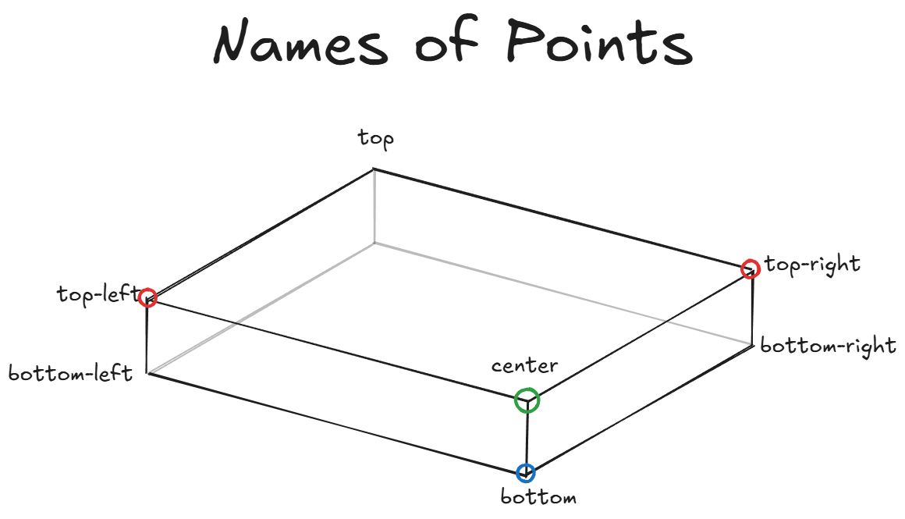
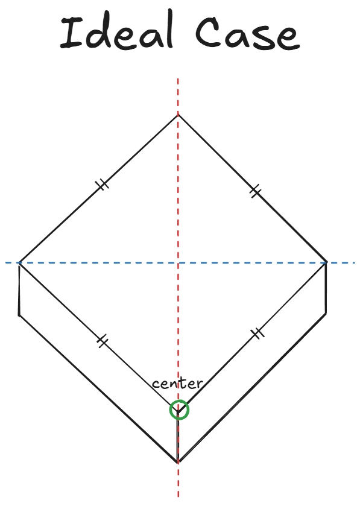

# Isometric Tile System

The goals: to find the minimum amount of data of an isometric tile sprite, to make it tileable.

In computer graphic when you load a sprite you only know it's dimension.
and when you render it on the screen you place the top left corner -- the topmost leftmost pixel is (0,0)
This sprite position it is its origin, we can call it point O.

Axiom one: Isometric tiles have all axies parallel, and equal side length.

now there are two types of isometric tiles - parallelogram faces, and rhombus faces, with rumbus faces.

also depending if you 'height' of the parallelogram is parallel to the y axios or not you can solve for less point.

in the best case scenario you need only one point - which will need a name - the point that is the forward to the viewer which is 'inside' the shape,

the worst case scenario is 4 point, the first one plus two other sides.

in the first image we can see what are the 4 points needs - top-left, top-right, center and bottom.

if you height side - the depth of the parallelogram - is parallel to the y-axis, we dont need the bottom point as it can be calculated.

if you are working with a square tile - looks like a rhombus, that it's top is stacked on top of it's center and bottom points, and also parallel to the y-axis we only need the center point the reset can be calculated.

